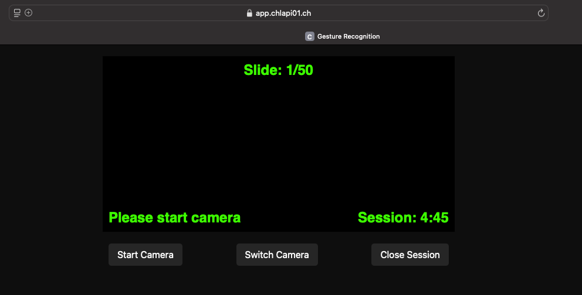

# Hand Gesture Recognition with Machine Learning

This repository provides a comprehensive solution for recognizing hand gestures using machine learning. It includes tools for data collection, model training, and real-time gesture recognition. The project is suitable for both beginners and experienced users interested in computer vision and machine learning.

## Table of Contents
- [Features](#features)
- [Setup](#setup)
- [How to Use](#how-to-use)
  - [Using the Pretrained Model](#using-the-pretrained-model)
  - [Using the Pretrained Model online](#using-the-pretrained-model-online)
  - [Using Your Own Dataset](#using-your-own-dataset)
- [File Overview](#file-overview)
- [License](#license)

---

## Features
- **Data Capture**: Tools to collect and label hand gesture data efficiently.
- **Model Training**: Train a machine learning model to recognize gestures with custom or predefined datasets.
- **Real-Time Recognition**: Use the trained model to perform real-time gesture recognition through a webcam.
- **Action Mapping**: Map gestures to specific commands or actions, such as controlling slides or applications.

---

## Setup

### Requirements
To run the project, you need the following:
- **Webcam**: A webcam or camera connected to your system.
- **Python**: The project is developed using Python. You can download Python from the official website: [python.org](https://www.python.org/downloads/).
- **Python Libraries**: The project requires the following Python libraries:
  - `opencv-python`: For capturing and processing webcam frames.
  - `mediapipe`: For hand tracking and gesture recognition.
  - `numpy`: For numerical operations and data manipulation.
  - `sqlite3`: For storing and managing gesture data.
  - `joblib`: For saving and loading machine learning models.
  - `pandas`: For data manipulation and analysis.
  - `pyautogui`: For simulating keyboard and mouse inputs.
  - `scikit-learn`: For machine learning model training and evaluation.
  - `matplotlib`: For data visualization and plotting.
  - `seaborn`: For statistical data visualization.


### Installation
1. Clone the repository:
   ```bash
   git clone https://github.com/vwyer/gesture-ml.git
   cd gesture-ml
   ```
2. Install the dependencies:
   ```bash
   pip install -r requirements.txt
   ```

---

## How to Use

### Using the Pretrained Model localy
To quickly test the pretrained model:
1. Run the `gesturelive.py` script:
   ```bash
   python gesturelive.py
   ```
2. The pretrained model supports the following gestures:
   - **"next"**: Advances to the next slide.  
     
   - **"back"**: Goes back to the previous slide.  
     


   - **"nothing"**: No gesture detected.

3. Show the gestures to the webcam to trigger the corresponding actions.

For enhanced functionality, use `gesturelivecommand.py` to trigger specific actions:
1. Set the key mappings:
   ```python
   GESTURE_KEY_MAPPING = {
       "next": "right",  # Simulates pressing the right arrow key.
       "back": "left",   # Simulates pressing the left arrow key.
   }
   ```
2. Run the script:
   ```bash
   python gesturelivecommand.py
   ```

### Using the Pretrained Model online
You can test the gesture recognition model online with out any installation, using the following link:
[Gesture Recognition Online Demo](https://app.chlapi01.ch)




### Using Your Own Dataset

If you wish to train a model with your own gestures, follow these steps:

#### Step 1: Data Capture
1. Configure the following parameters in `learn_new_gesture.py`:
   ```python
   GESTURE_TYPE = "nothing"  # Set the name of the gesture you want to record.
   FRAME_COUNT = 0  # Starting frame count.
   MAX_FRAMES = 1000  # Maximum number of frames to capture.
   SPEED = 0.5  # Time interval (in seconds) between frame captures.
   ```
2. Run the script:
   ```bash
   python learn_new_gesture.py
   ```
3. Record your gesture by showing it consistently to the webcam. Ensure no other gestures or distractions are visible during recording. Data will be saved and labeled in the `hand_gestures.db` database. 
    
    


#### Step 2: Train the Model
1. Adjust training parameters in `train_model.py` if needed.
2. Train the model by running:
   ```bash
   python train_model.py
   ```
3. The script will preprocess the data, train a new model, and save it for use in real-time recognition.
4. It also generates a confusion matrix and classification report to evaluate the model's performance.

#### Step 3: Real-Time Recognition
1. Update gesture labels in `gesturelive.py`:
   ```python
   GESTURE_LABELS = {
       "next": "Next slide",
       "back": "Previous slide",
       "nothing": "Nothing detected",
   }
   ```
2. Run the script:
   ```bash
   python gesturelive.py
   ```
3. The system will recognize gestures in real time using your trained model.

For enhanced functionality, use `gesturelivecommand.py` to trigger specific actions:
1. Set gesture labels and key mappings:
   ```python
   GESTURE_LABELS = {
       "next": "Next slide",
       "back": "Previous slide",
       "nothing": "Nothing detected",
   }
   GESTURE_KEY_MAPPING = {
       "next": "right",  # Simulates pressing the right arrow key.
       "back": "left",   # Simulates pressing the left arrow key.
   }
   ```
2. Run the script:
   ```bash
   python gesturelivecommand.py
   ```

---

## File Overview
- **`learn_new_gesture.py`**: Script for capturing and labeling hand gesture data.
- **`train_model.py`**: Script to train a machine learning model for gesture recognition.
- **`gesturelive.py`**: Script for real-time gesture recognition.
- **`gesturelivecommand.py`**: Script for recognizing gestures and mapping them to actions or keyboard events.
- **`hand_gestures.db`**: SQLite database storing gesture data.
- **`README.md`**: Project documentation.
- **`LICENSE`**: License for the project.

---

## License
This project is licensed under the [LICENSE](./LICENSE) file. You are free to use, modify, and distribute this project in accordance with the license terms.
```

## Questions
If you have any questions or need assistance, feel free to reach out via email at [valentin.wyer@students.ffhs.ch](mailto:valentin.wyer@students.ffhs.ch). You can also explore more of my projects on my [GitHub page](https://github.com/vwyer).